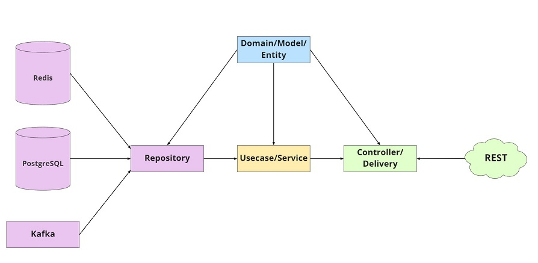

# project-golang-crud

### Deskripsi Folder :

* conf/
Deskripsi: Folder ini menyimpan file konfigurasi untuk aplikasi, seperti config.env, yang berisi variabel lingkungan seperti URL database.
File:
config.env: Berisi variabel lingkungan seperti DATABASE_URL untuk menghubungkan ke database PostgreSQL.

* domains/
Deskripsi: Folder ini berisi definisi model atau struktur data yang digunakan dalam aplikasi. Model ini biasanya merepresentasikan entitas dari domain aplikasi.
File:
models.go: Berisi struktur model User yang dikelola oleh GORM dan digunakan dalam operasi CRUD.

* pkg/
Deskripsi: Folder ini berisi modul-modul aplikasi yang mengimplementasikan arsitektur bersih. Terdapat tiga subfolder utama:

* pkg/config/
Deskripsi: Berisi konfigurasi dan inisialisasi aplikasi, termasuk pengaturan database.
File:
config.go: Menyediakan fungsi Init untuk menginisialisasi koneksi database dan migrasi skema.

* pkg/delivery/
Deskripsi: Folder ini menangani penerimaan dan pengolahan HTTP request. Di sini didefinisikan handler HTTP untuk berbagai endpoint.
File:
handler.go: Mengimplementasikan handler untuk CRUD operations, termasuk pembuatan, pengambilan, pembaruan, dan penghapusan data.

* pkg/usecase/
Deskripsi: Folder ini berisi logika bisnis dan aturan aplikasi. Usecase menghubungkan antara delivery layer dan repository layer.
File:
usecase.go: Mendefinisikan interface UserUsecase dan implementasinya, yang memproses logika aplikasi untuk operasi CRUD.

* pkg/repository/
Deskripsi: Folder ini mengelola akses data dan integrasi dengan database. Repository berfungsi sebagai lapisan akses data dan menyediakan fungsi untuk berinteraksi dengan database.
File:
repository.go: Implementasi fungsi CRUD untuk model User yang berkomunikasi dengan database menggunakan GORM.

* swagger/
Deskripsi: Folder ini berisi file dokumentasi API dalam format Swagger/OpenAPI. Dokumen ini mendeskripsikan API dan endpoint yang tersedia untuk aplikasi.
File:
swagger.yaml: File dokumentasi API dalam format YAML, yang digunakan untuk menghasilkan dokumentasi API yang dapat diakses oleh pengembang dan alat lainnya.

##### The diagram 

More explanation about clean code architecture can read from this
medium's post :
> https://medium.com/@imantumorang/golang-clean-archithecture-efd6d7c43047.